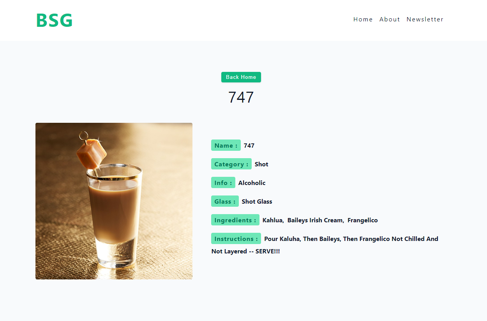

<h1><a href="https://bsg2101.github.io/mixMaster-bsg/">Live Demo</a></h1>

<h2>1-Home Page</h2>

 
<h2>2.NewsLetter Page</h2>

 
<h2>3.Details Page</h2>

#### Install and Setup

- npm install
- npm run dev

#### Setup Pages

- pages are components
- create src/pages
- About, Cocktail, Error, HomeLayout, Landing, Newsletter, index.js
- export from index.js

pages/index.js
